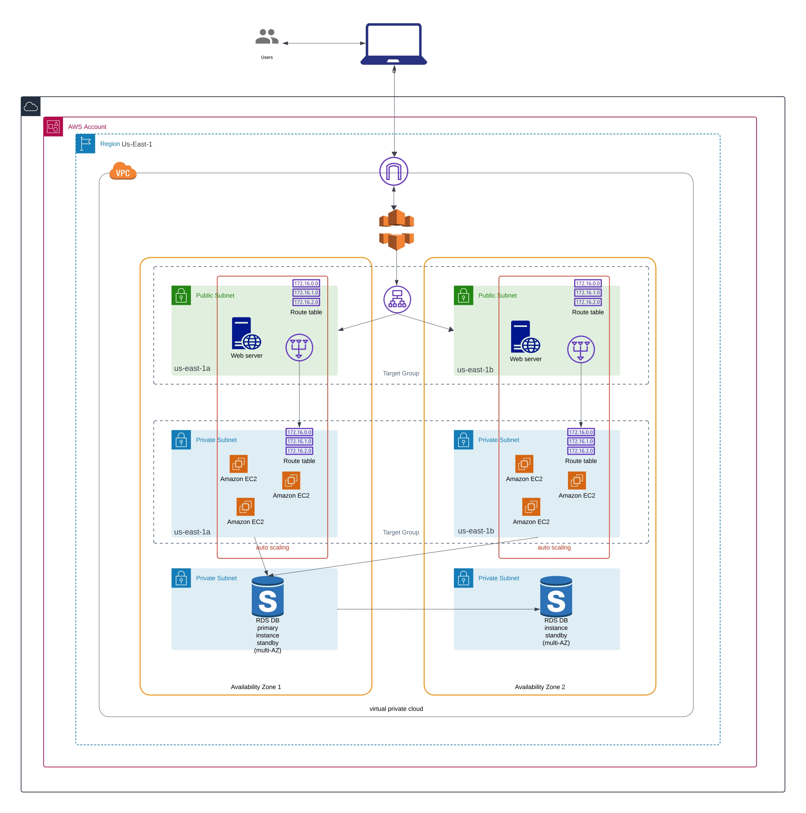

# Odoo 18.0 High Availability (HA) Deployment

This repository contains the source code and configuration files for deploying **Odoo 18.0** in a **High Availability (HA)** setup. The deployment setup is designed to ensure Odoo's scalability, reliability, and performance i n a production environment.

## Project Overview

- **High Availability (HA)** for Odoo 18.0 deployment.
- Dockerized Odoo with multi-instance setup for load balancing.
- Automated infrastructure provisioning using **Terraform**.
- Scalable database setup for Odoo (PostgreSQL cluster).
- Support for Odoo customizations and additional modules.
- Easy-to-use GitHub Actions workflows for CI/CD.

## Prerequisites

To deploy and work with this setup, ensure you have the following prerequisites installed configured:

- **Docker** (for packaging code)
- **kubectl** (for managing Kubernetes clusters)
- **AWS ECR** (for storing the Docker image)
- **Kubernetes** cluster (running in AWS, GCP, or any other cloud provider)
- **Terraform** (for managing infrastructure)
- **Python 3.x** (for any development or manual setups)
- **AWS CLI** (if you're using AWS as your cloud provider)
- **GitHub account** (for accessing GitHub Actions)

Additionally, ensure you have access to a cloud provider (like **AWS**, **GCP**, or **Azure**) for provisioning infrastructure if you're using the Terraform scripts.

## 1. Installation

- ### Install Docker

    ``` bash
    sudo apt-get update
    sudo apt-get install -y docker.io
    sudo systemctl enable docker
    sudo systemctl start docker
    ```

- ### Install AWS CLI
    If you haven't already, install the AWS CLI to interact with AWS services:

    ``` bash
    # Install AWS CLI
    sudo apt-get install -y awscli
    ```
    Make sure you configure the AWS CLI with your credentials:

    ``` bash
    aws configure
    ```

-   ### Install kubectl

    If you're deploying the application to Kubernetes, you will need to install kubectl:

    ``` bash
    # Install kubectl
    sudo apt-get update
    sudo apt-get install -y kubectl
    ```
-   ### Install Terraform

    For provisioning the infrastructure, install Terraform:

    ``` bash
    # Install Terraform
    sudo apt-get update
    sudo apt-get install -y wget unzip
    wget https://releases.hashicorp.com/terraform/1.3.7/terraform_1.3.7_linux_amd64.zip
    unzip terraform_1.3.7_linux_amd64.zip
    sudo mv terraform /usr/local/bin/
    ```

##  2.  Clone the Repository

First, clone the repository to your local machine or server:

```bash
git clone https://github.com/oriafo/ha_odoo-18.0_deployment.git
cd ha_odoo-18.0_deployment
```

## 3. Configure PostgreSQL Database (HA Setup)

The repository includes configurations for setting up PostgreSQL in a high-availability (HA) configuration, such as master-slave replication.

You can find the relevant configuration files under the postgresql directory.

1. **Initialize and configure the PostgreSQL cluster:**

   Ensure your database instances (master and slave) are correctly configured and running. You can find the configuration files in the `postgresql/` directory.

2. **Configure your Odoo instance to connect to the HA PostgreSQL cluster by modifying the odoo.conf file located in the odoo/ directory.**

Example `odoo.conf` configuration:

```ini
[options]
db_host = db_master_ip
db_port = 5432
db_user = odoo_user
db_password = odoo_password
addons_path = addons
logfile = /var/log/odoo/odoo.log
```

## 5. Set Up Load Balancing (Optional)

If you're deploying Odoo with multiple application nodes, you may wish to set up a load balancer (such as Nginx or HAProxy) to balance the traffic between your Odoo instances.

Example Nginx Configuration:

``` bash
upstream odoo {
    server odoo-instance-1:8069;
    server odoo-instance-2:8069;
}

server {
    listen 80;
    
    server_name yourdomain.com;

    location / {
        proxy_pass http://odoo;
        proxy_set_header Host $host;
        proxy_set_header X-Real-IP $remote_addr;
        proxy_set_header X-Forwarded-For $proxy_add_x_forwarded_for;
    }
}
```
### 6. Run Terraform to Provision Infrastructure as described in the diagram below


If you're deploying on cloud infrastructure (AWS, GCP, etc.), the repository includes Terraform scripts to provision the necessary infrastructure for high availability.

1. **Create remote backend infrastructure:**

    ``` bash
    cd infra/backend/
    terraform init
    terraform apply -auto-approve
    
    ```
    `Note:` environment can be dev, staging, production and global, as this represent different deployment environment
2. **Navigate to the Terraform directory:**

    ``` bash
    cd infra/file-structure/<environment>
    ```
    `Note:` environment can be dev, staging, production and global, as this represent different deployment environment
3. **Initialize Terraform:**

    Initialize Terraform with the following command:

    ``` bash
    terraform init
    ```
4.  **Check the resources to be provisioned:**

    After setting up your cloud provider credentials (e.g., AWS, GCP), check for the resources in the configuration to apply:

    ``` bash
    terraform plan -out=plan.tfplan

5.  **Apply the configuration:**

    After setting up your cloud provider credentials (e.g., AWS, GCP), apply the configuration to provision the infrastructure:

    ``` bash
    terraform apply -auto-approve
    ```
    Follow the prompts to approve and provision the resources.

6.  **Access your deployed Odoo instance:**

    Once Terraform finishes provisioning the resources, it will output the IP addresses or domain names of the deployed infrastructure. Access your Odoo application via the provided URL.

### 7. Configure the Odoo Application

Make sure the Odoo application is properly configured to work with the database, and load balancer. Modify odoo.conf according to your deployment setup.

## GitHub Actions CI/CD Workflows

This repository includes automated GitHub Actions workflows to streamline deployment and testing.

#### Available Workflows

-   `infra.yml`: Automates the deployment of Odoo using Terraform and Kubernetes setup.

-   `destroy.yml`: Automate the destruction of deployed terraform resources.

#### How to Trigger Workflows

`Infra` Workflow is automatically triggered by `pull request` to the `staging` and `main` branches. You can manually trigger `destroy` workflow from the Actions tab in GitHub.

For example, to trigger a deployment, create a `pull request` to the `staging` and `main` branch:

``` bash 
gh pr create --base <branch to merge into> --head <branch to merge from> --title <"Title of your pull request"> --body <"Detailed description of your changes">
```
GitHub Actions will automatically trigger the `infra.yml` workflow to deploy your changes.  

